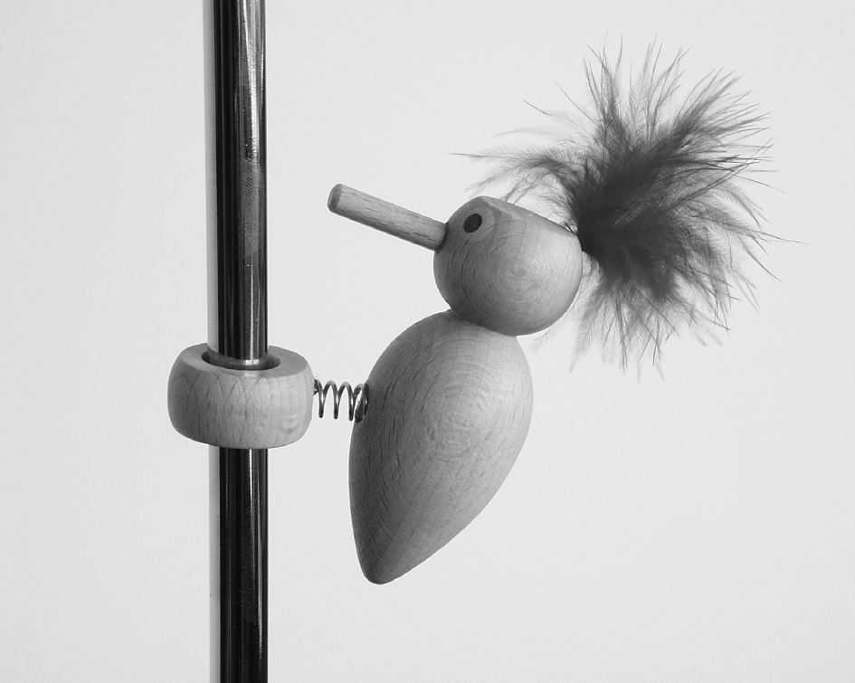
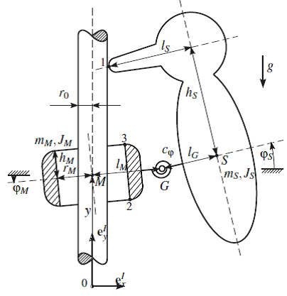

# Simulating the Woodpecker Toy

Michael Baumann, Gabriel Nützi, July 2017
_________________________________________

**Simulation of the woodpecker toy
using Moreau's Timestepping scheme with SOR-prox method (for planar problems)**

<table>
    <tr>
    <td width="56%">
        
    </td>
    <td>
        
    </td>
    </tr>
</table>

**The Result:**   

