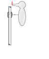

# Simulating the Woodpecker Toy

Michael Baumann, Gabriel Nützi, July 2017
_________________________________________

**Simulation of the woodpecker toy
using Moreau's Timestepping scheme with SOR-prox method (for planar problems)**

Model: http://www.zfm.ethz.ch/~glocker/PublicationPDF/Conference%20Proceedings/bw_2001_ASME_Pittsburgh.pdf

<table style="background:#FFF;border-width:0pt;border-color:#AAAAAA;border-style:solid;">
    <tr style="background:#FFF;border-width:0pt;border-color:#AAAAAA;border-style:solid;">
    <td width="56%" style="background:#FFF;border-width:0pt;border-color:#AAAAAA;border-style:solid;">
        
    </td>
    <td style="background:#FFF;border-width:0pt;border-color:#AAAAAA;border-style:solid;">
        
    </td>
    <tr>
</table>

      

